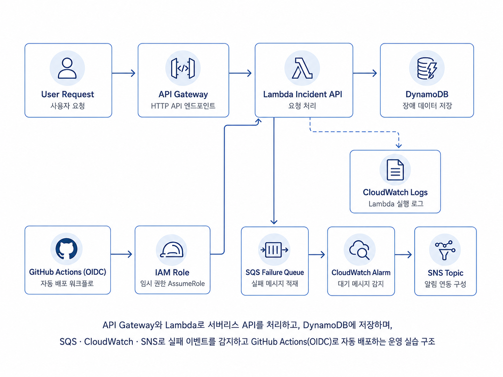
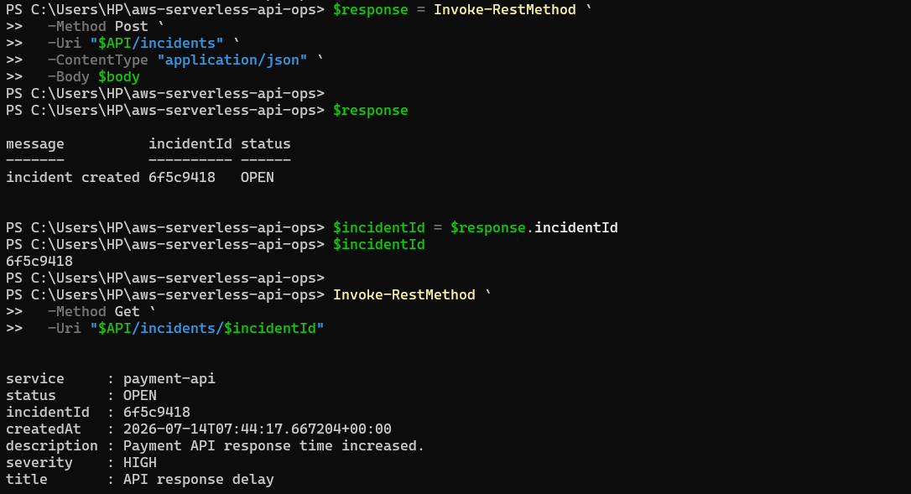
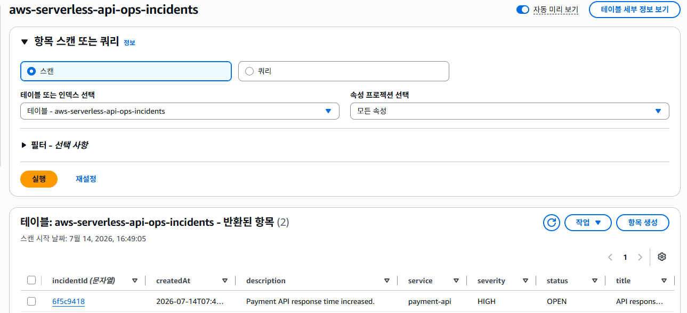
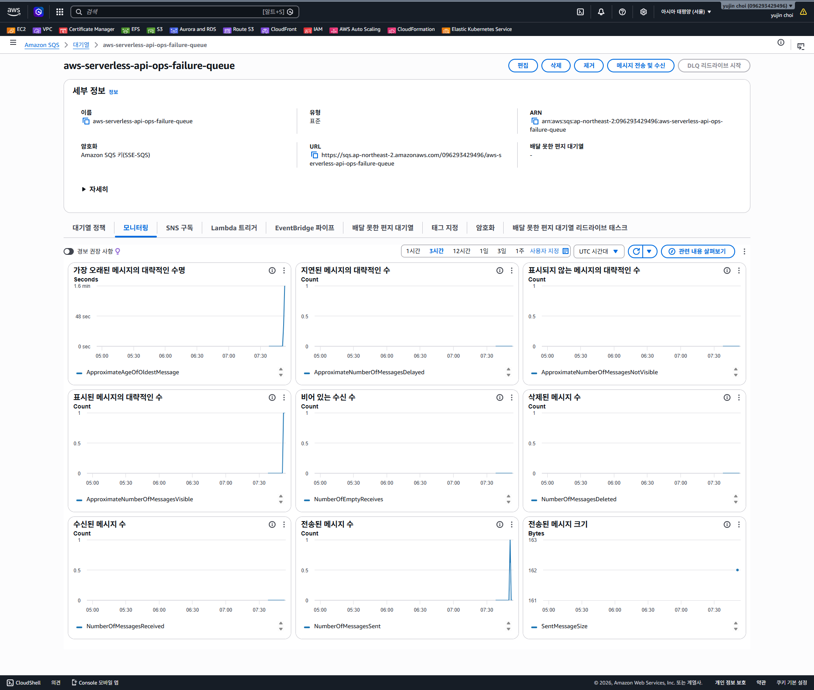
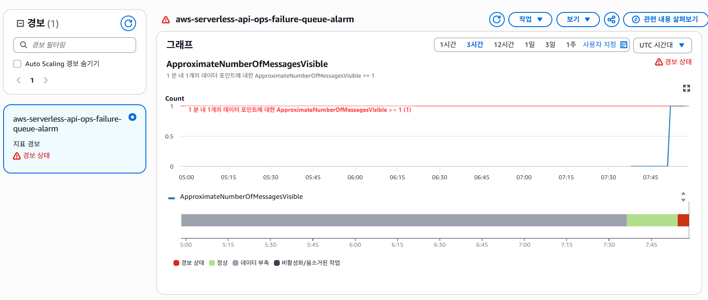
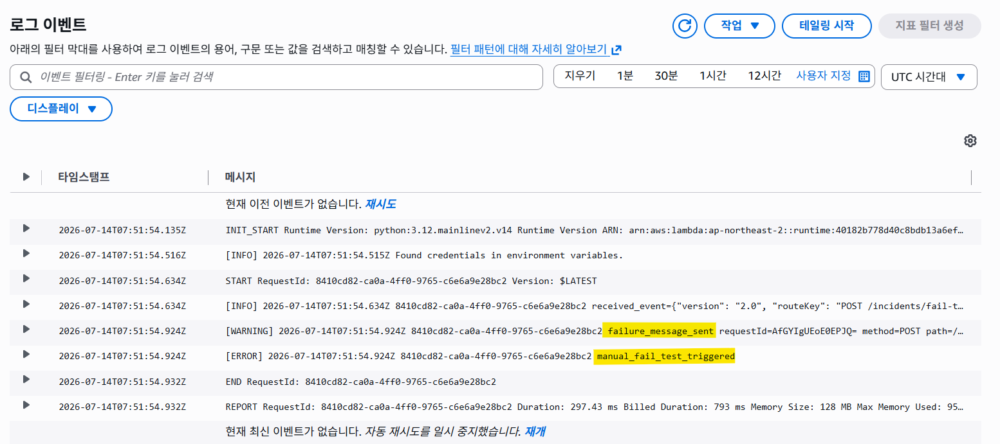
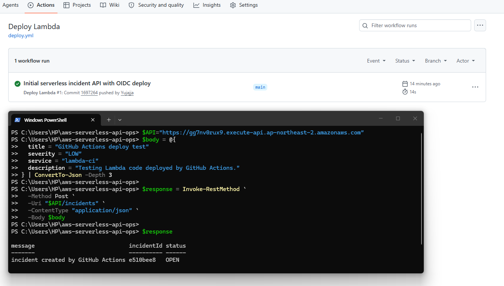

# AWS Serverless API 운영 실습 - 비용 최적화와 CI/CD 자동 배포

## 1. 프로젝트 개요

이 프로젝트는 AWS 운영 실습 시리즈 3차 프로젝트입니다.

1차와 2차 실습에서는 EC2 기반 웹 서버 운영, ALB, Private Subnet, Auto Scaling Group, CloudWatch Alarm을 다뤘습니다. 이번 3차 실습에서는 상시 실행되는 EC2 구조 대신 API Gateway, Lambda, DynamoDB, SQS를 사용해 서버리스 기반 장애 접수 API를 구성했습니다.

단순히 API를 만드는 것에 그치지 않고, 장애 데이터 저장, 실패 요청 분리, 로그 확인, CloudWatch Alarm 감지, SNS 알림, GitHub Actions 기반 Lambda 자동 배포까지 운영 흐름으로 연결했습니다.

---

## 2. 프로젝트 목표

- EC2 없이 Serverless 기반 API 구성
- API Gateway HTTP API와 Lambda 연동
- Lambda에서 장애 접수 요청 처리
- DynamoDB에 장애 데이터 저장
- 실패 요청을 SQS Failure Queue로 분리
- CloudWatch Logs로 Lambda 실행 로그 확인
- CloudWatch Alarm으로 SQS 실패 메시지 감지
- SNS Topic을 통한 장애 알림 구성
- GitHub Actions와 OIDC를 활용한 Lambda 자동 배포
- 장기 AWS Access Key 없이 배포 가능한 구조 구성
- Terraform으로 AWS 리소스 생성 및 삭제
- 실습 종료 후 리소스 정리로 비용 관리

---

## 3. 기술 스택

| 구분 | 기술 |
|---|---|
| Cloud | AWS |
| API | API Gateway HTTP API |
| Compute | AWS Lambda |
| Runtime | Python 3.12 |
| Database | DynamoDB |
| Queue | Amazon SQS |
| Monitoring | CloudWatch Logs, CloudWatch Alarm |
| Notification | Amazon SNS |
| IAM | IAM Role, IAM Policy, OIDC Provider |
| IaC | Terraform |
| CI/CD | GitHub Actions |
| Tool | PowerShell, VSCode, AWS CLI |
| Documentation | Markdown |

---

## 4. 프로젝트 구조

```text
aws-serverless-api-ops
├─ .github
│  └─ workflows
│     └─ deploy.yml
├─ docs
│  └─ images
│     ├─ 00-serverless-api-flow.png
│     ├─ 01-api-incident-create-and-get.png
│     ├─ 02-dynamodb-incident-item.png
│     ├─ 03-sqs-failure-queue.png
│     ├─ 04-cloudwatch-alarm-sqs.png
│     ├─ 05-cloudwatch-lambda-logs.png
│     └─ 06-github-actions-deploy-success.png
├─ lambda
│  └─ app.py
├─ .gitignore
├─ .terraform.lock.hcl
├─ main.tf
├─ outputs.tf
├─ provider.tf
├─ terraform.tfvars.example
├─ variables.tf
└─ README.md
```

---

## 5. Serverless API 운영 및 자동 배포 흐름



이번 프로젝트의 전체 흐름은 크게 세 가지로 나눌 수 있습니다.

### 5.1 정상 요청 처리 흐름

```text
사용자
  ↓
API Gateway HTTP API
  ↓
Lambda Incident API
  ↓
DynamoDB
```

사용자가 `POST /incidents` 요청을 보내면 API Gateway가 Lambda를 호출합니다. Lambda는 요청 데이터를 검증한 뒤 `incidentId`를 생성하고 DynamoDB에 장애 데이터를 저장합니다.

`GET /incidents/{incidentId}` 요청을 보내면 Lambda가 DynamoDB에서 해당 장애 데이터를 조회해 응답합니다.

### 5.2 실패 요청 감지 흐름

```text
Lambda
  ↓
SQS Failure Queue
  ↓
CloudWatch Alarm
  ↓
SNS Topic
  ↓
Email Notification
```

필수 입력값이 누락되거나, 수동 실패 테스트 API가 호출되거나, 예상하지 못한 예외가 발생하면 Lambda는 실패 정보를 SQS Failure Queue에 적재합니다.

CloudWatch Alarm은 SQS Failure Queue의 메시지 수를 감시합니다. 메시지가 1개 이상 쌓이면 `ALARM` 상태로 전환되고 SNS Topic을 통해 이메일 알림을 보냅니다.

### 5.3 자동 배포 흐름

```text
GitHub Push
  ↓
GitHub Actions
  ↓
OIDC 기반 AWS 인증
  ↓
IAM Deploy Role Assume
  ↓
Lambda 코드 패키징
  ↓
Lambda 함수 코드 업데이트
```

GitHub Actions는 장기 Access Key를 사용하지 않고 OIDC를 통해 AWS IAM Role을 Assume합니다. 이후 Lambda 코드를 zip으로 패키징하고 지정된 Lambda 함수의 코드를 업데이트합니다.

---

## 6. API 명세

### 6.1 장애 접수 생성

```text
POST /incidents
```

요청 Body 예시:

```json
{
  "title": "API response delay",
  "severity": "HIGH",
  "service": "payment-api",
  "description": "Payment API response time increased."
}
```

필수 값:

```text
title
severity
service
```

성공 응답 예시:

```json
{
  "message": "incident created",
  "incidentId": "6f5c9418",
  "status": "OPEN"
}
```

### 6.2 장애 접수 조회

```text
GET /incidents/{incidentId}
```

성공 응답 예시:

```json
{
  "incidentId": "6f5c9418",
  "title": "API response delay",
  "severity": "HIGH",
  "service": "payment-api",
  "status": "OPEN",
  "description": "Payment API response time increased.",
  "createdAt": "2026-07-14T00:00:00+00:00"
}
```

조회 대상이 없을 때 응답:

```json
{
  "message": "incident not found",
  "incidentId": "6f5c9418"
}
```

### 6.3 실패 테스트 API

```text
POST /incidents/fail-test
```

이 API는 실패 요청 감지 흐름을 검증하기 위한 실습용 API입니다. 호출 시 Lambda가 실패 메시지를 SQS Failure Queue에 적재하고 500 응답을 반환합니다.

응답 예시:

```json
{
  "message": "fail-test triggered",
  "detail": "failure message was sent to SQS"
}
```

---

## 7. Lambda 주요 구현 내용

Lambda 함수는 `lambda/app.py`에 구현했습니다.

주요 함수:

| 함수 | 역할 |
|---|---|
| `json_response()` | API Gateway 응답 형식 생성 |
| `parse_body()` | 요청 Body 파싱 |
| `get_request_info()` | Request ID, Method, Path 추출 |
| `send_failure_message()` | 실패 정보를 SQS에 전송 |
| `create_incident()` | 장애 접수 생성 및 DynamoDB 저장 |
| `get_incident()` | 장애 접수 조회 |
| `fail_test()` | 실패 큐 테스트 |
| `lambda_handler()` | Route Key 기준 요청 분기 |

### 7.1 요청 처리 방식

API Gateway HTTP API의 `routeKey`를 기준으로 요청을 분기합니다.

```text
POST /incidents              → create_incident()
GET /incidents/{incidentId}  → get_incident()
POST /incidents/fail-test    → fail_test()
```

### 7.2 로그 보안 정리

초기 구현에서는 API Gateway `event` 전체를 로그로 남길 수 있었습니다. 하지만 운영 환경에서는 요청 Body 전체가 CloudWatch Logs에 저장될 경우 민감 정보가 함께 남을 수 있습니다.

따라서 전체 요청 이벤트 대신 다음 정보만 기록하도록 정리했습니다.

```text
requestId
method
path
routeKey
```

예상하지 못한 예외가 발생한 경우에도 SQS에는 상세 예외 문자열을 넣지 않고 일반화된 사유만 저장합니다.

```text
unexpected_error
```

이를 통해 CloudWatch Logs에서는 장애 추적에 필요한 최소 정보만 확인하고, SQS에는 실패 요청 분류에 필요한 정보만 남기도록 구성했습니다.

---

## 8. DynamoDB 구성

DynamoDB는 장애 접수 데이터를 저장하는 용도로 사용했습니다.

```text
Table Name: aws-serverless-api-ops-incidents
Billing Mode: PAY_PER_REQUEST
Partition Key: incidentId
```

저장 데이터 예시:

```json
{
  "incidentId": "6f5c9418",
  "title": "API response delay",
  "severity": "HIGH",
  "service": "payment-api",
  "status": "OPEN",
  "description": "Payment API response time increased.",
  "createdAt": "2026-07-14T00:00:00+00:00"
}
```

DynamoDB는 On-Demand 방식인 `PAY_PER_REQUEST`로 구성해 실습 규모에서 고정 용량을 따로 관리하지 않도록 했습니다.

---

## 9. SQS Failure Queue 구성

실패 요청을 분리하기 위해 SQS Failure Queue를 구성했습니다.

```text
Queue Name: aws-serverless-api-ops-failure-queue
Message Retention: 14 days
```

SQS에 적재되는 메시지 예시:

```json
{
  "requestId": "example-request-id",
  "reason": "manual_fail_test",
  "path": "/incidents/fail-test",
  "method": "POST",
  "createdAt": "2026-07-14T00:00:00+00:00"
}
```

SQS에 적재하는 실패 사유는 다음과 같이 구분했습니다.

| Reason | 의미 |
|---|---|
| `required_field_missing` | 필수 입력값 누락 |
| `incident_id_path_parameter_missing` | 조회 경로 파라미터 누락 |
| `manual_fail_test` | 실패 테스트 API 호출 |
| `unexpected_error` | 예상하지 못한 예외 발생 |

---

## 10. CloudWatch Logs 구성

Lambda 실행 로그를 CloudWatch Logs에서 확인할 수 있도록 Log Group을 구성했습니다.

```text
Log Group: /aws/lambda/aws-serverless-api-ops-incident-api
Retention: 1 day
```

로그 예시:

```text
request_received requestId=... method=POST path=/incidents routeKey=POST /incidents
incident_created requestId=... incidentId=... severity=HIGH service=payment-api status=OPEN
failure_message_sent requestId=... method=POST path=/incidents/fail-test reason=manual_fail_test
manual_fail_test_triggered requestId=... method=POST path=/incidents/fail-test
```

CloudWatch Logs 보관 기간은 실습 비용 관리를 위해 1일로 설정했습니다.

---

## 11. CloudWatch Alarm과 SNS 구성

SQS Failure Queue에 메시지가 쌓였는지 감지하기 위해 CloudWatch Alarm을 구성했습니다.

```text
Namespace: AWS/SQS
Metric: ApproximateNumberOfMessagesVisible
Statistic: Maximum
Period: 60 seconds
Evaluation Periods: 1
Threshold: 1
Condition: GreaterThanOrEqualToThreshold
Treat Missing Data: notBreaching
```

감지 흐름:

```text
SQS Failure Queue 메시지 1개 이상
  ↓
CloudWatch Alarm ALARM 상태 전환
  ↓
SNS Topic으로 알림 전송
  ↓
Email 수신
```

SNS Topic에는 이메일 구독을 연결했습니다. 실습 중에는 SNS 구독 확인 메일을 승인한 뒤 알림 흐름을 확인했습니다.

---

## 12. GitHub Actions CI/CD 구성

GitHub Actions를 사용해 Lambda 코드 자동 배포를 구성했습니다.

Workflow 파일:

```text
.github/workflows/deploy.yml
```

실행 조건:

```text
main 브랜치에 push
lambda/** 변경
.github/workflows/deploy.yml 변경
```

배포 흐름:

```text
Checkout source code
  ↓
Configure AWS credentials with OIDC
  ↓
Package Lambda function
  ↓
Deploy Lambda function code
```

GitHub Actions에서는 다음 Repository Variables를 사용합니다.

| Variable | 값 |
|---|---|
| `AWS_ROLE_ARN` | GitHub Actions가 Assume할 AWS IAM Role ARN |
| `LAMBDA_FUNCTION_NAME` | 배포 대상 Lambda 함수명 |

Workflow에서는 다음과 같이 참조합니다.

```yaml
role-to-assume: ${{ vars.AWS_ROLE_ARN }}
```

```yaml
--function-name "${{ vars.LAMBDA_FUNCTION_NAME }}"
```

이를 통해 AWS 계정 ID와 Lambda 함수명을 Workflow 파일에 직접 고정하지 않고 관리할 수 있도록 개선했습니다.

---

## 13. IAM 최소 권한 구성

### 13.1 Lambda 실행 Role

Lambda 실행 Role에는 필요한 권한만 부여했습니다.

| 대상 | 권한 |
|---|---|
| DynamoDB | `PutItem`, `GetItem` |
| SQS | `SendMessage` |
| CloudWatch Logs | `CreateLogStream`, `PutLogEvents` |

Lambda는 장애 데이터를 DynamoDB에 저장·조회하고, 실패 정보를 SQS에 전송하며, 실행 로그를 CloudWatch Logs에 기록합니다.

### 13.2 GitHub Actions Deploy Role

GitHub Actions 배포 Role은 OIDC 기반으로 Assume하도록 구성했습니다.

신뢰 조건은 현재 GitHub 저장소의 `main` 브랜치로 제한했습니다.

```text
repo:Yujajja/aws-serverless-api-ops:ref:refs/heads/main
```

배포 Role 권한은 특정 Lambda 함수 코드 업데이트에 필요한 권한으로 제한했습니다.

```text
lambda:GetFunction
lambda:GetFunctionConfiguration
lambda:UpdateFunctionCode
```

장기 Access Key를 GitHub Secrets에 저장하지 않고, OIDC 기반 임시 인증을 사용한 것이 핵심입니다.

---

## 14. Terraform 구성

Terraform으로 AWS 리소스를 코드화했습니다.

| 파일 | 역할 |
|---|---|
| `provider.tf` | AWS Provider 및 Region 설정 |
| `variables.tf` | 프로젝트명, 이메일, GitHub 저장소 등 변수 정의 |
| `main.tf` | 주요 AWS 리소스 정의 |
| `outputs.tf` | API Endpoint 등 출력값 정의 |
| `terraform.tfvars.example` | 변수 입력 예시 |
| `.gitignore` | 민감 정보 및 상태 파일 제외 |

주요 리소스:

```text
archive_file
DynamoDB Table
SQS Queue
SNS Topic
SNS Topic Subscription
CloudWatch Log Group
IAM Role / Policy
Lambda Function
API Gateway HTTP API
API Gateway Integration
API Gateway Routes
API Gateway Stage
Lambda Permission
CloudWatch Metric Alarm
GitHub Actions OIDC Provider
GitHub Actions Deploy Role
```

Terraform 실행 흐름:

```powershell
terraform fmt
terraform init
terraform validate
terraform plan -out=tfplan
terraform apply "tfplan"
```

실습 종료 후 리소스 정리:

```powershell
terraform destroy
terraform state list
```

---

## 15. 실행 결과

### 15.1 API 장애 접수 및 조회 확인

`POST /incidents` 요청으로 장애 데이터를 생성하고, 응답으로 받은 `incidentId`를 사용해 `GET /incidents/{incidentId}` 조회까지 확인했습니다.



---

### 15.2 DynamoDB 저장 확인

Lambda에서 생성한 장애 데이터가 DynamoDB 테이블에 정상 저장된 것을 확인했습니다.



---

### 15.3 SQS 실패 큐 적재 확인

`POST /incidents/fail-test` API를 호출한 뒤 SQS Failure Queue에 실패 메시지가 적재된 것을 확인했습니다.



---

### 15.4 CloudWatch Alarm 감지 확인

SQS Failure Queue의 메시지 수가 1 이상이 되자 CloudWatch Alarm이 `ALARM` 상태로 전환되는 것을 확인했습니다.



---

### 15.5 Lambda 로그 확인

CloudWatch Logs에서 요청 수신, 장애 접수 생성, 실패 메시지 전송, 실패 테스트 실행 로그를 확인했습니다.



---

### 15.6 GitHub Actions 자동 배포 확인

GitHub Actions Workflow가 성공적으로 실행되었고, Lambda 코드 변경 후 API 응답 메시지가 변경되는 것을 확인했습니다.



---

## 16. 테스트 시나리오

### 16.1 정상 장애 접수 생성

```text
POST /incidents
  ↓
API Gateway
  ↓
Lambda
  ↓
DynamoDB 저장
  ↓
201 응답
```

검증 결과:

```text
incidentId 생성
status OPEN 저장
DynamoDB Item 생성
```

### 16.2 장애 접수 조회

```text
GET /incidents/{incidentId}
  ↓
API Gateway
  ↓
Lambda
  ↓
DynamoDB 조회
  ↓
200 응답
```

검증 결과:

```text
생성한 incidentId로 조회 성공
```

### 16.3 실패 요청 감지

```text
POST /incidents/fail-test
  ↓
Lambda
  ↓
SQS Failure Queue 메시지 적재
  ↓
CloudWatch Alarm ALARM 전환
```

검증 결과:

```text
SQS 메시지 적재 확인
CloudWatch Alarm 상태 전환 확인
```

### 16.4 GitHub Actions 자동 배포

```text
lambda/app.py 수정
  ↓
main 브랜치 push
  ↓
GitHub Actions 실행
  ↓
OIDC 인증
  ↓
Lambda 코드 업데이트
```

검증 결과:

```text
GitHub Actions 성공
Lambda 응답 메시지 변경 확인
```

---

## 17. 트러블슈팅

### 17.1 PowerShell 한글 인코딩 문제

#### 문제

초기 API 테스트에서 한글 요청 데이터가 깨져 보이는 문제가 있었습니다.

#### 원인

API Gateway, Lambda, DynamoDB 구조 문제가 아니라 PowerShell에서 JSON 요청을 전송할 때 인코딩 차이로 인해 발생한 문제였습니다.

#### 해결

검증 화면은 영어 데이터로 다시 테스트하여 정상 동작을 확인했습니다.

---

### 17.2 SNS 구독 메일 혼동

#### 문제

SNS 구독 확인 메일과 구독 해지 메일이 혼동되는 상황이 있었습니다.

#### 해결

이메일 수신 여부만 최종 검증 기준으로 삼지 않고, SQS Failure Queue 적재와 CloudWatch Alarm의 `ALARM` 상태 전환을 중심으로 실패 요청 감지 흐름을 검증했습니다.

---

### 17.3 Lambda 응답 문구와 배포 주체 혼동

#### 문제

초기 API 응답 메시지가 다음과 같이 되어 있었습니다.

```json
{
  "message": "incident created by GitHub Actions"
}
```

이 문구는 GitHub Actions가 장애 데이터를 생성한 것처럼 보일 수 있었습니다.

#### 해결

GitHub Actions는 배포 도구이고, 장애 데이터 생성 주체는 API 요청과 Lambda이므로 응답 문구를 다음처럼 수정했습니다.

```json
{
  "message": "incident created"
}
```

---

### 17.4 전체 이벤트 로그 기록 문제

#### 문제

초기 Lambda 코드에서는 API Gateway 이벤트 전체를 CloudWatch Logs에 기록할 수 있었습니다.

#### 원인

요청 Body 전체가 로그에 남을 수 있어 운영 환경에서는 민감 정보 노출 위험이 있습니다.

#### 해결

전체 이벤트 로그를 제거하고 다음 정보만 기록하도록 수정했습니다.

```text
requestId
method
path
routeKey
```

---

## 18. 보안 및 운영 고려사항

이번 실습에서 적용한 보안 요소는 다음과 같습니다.

```text
Lambda 실행 Role 최소 권한 구성
GitHub Actions OIDC 기반 임시 인증 사용
장기 AWS Access Key 미사용
GitHub Actions Deploy Role의 대상 저장소 및 main 브랜치 제한
Lambda 배포 권한을 특정 함수로 제한
CloudWatch Logs에 전체 요청 Body 기록하지 않도록 수정
terraform.tfvars와 상태 파일 Git 제외
```

운영 환경으로 확장할 경우 추가로 고려할 부분은 다음과 같습니다.

```text
API Gateway JWT Authorizer 또는 IAM 인증 적용
API Gateway Throttling 설정
API Gateway Access Log 활성화
Lambda 환경 변수 암호화 관리
DynamoDB TTL 적용
Dead Letter Queue 또는 재처리 흐름 구성
CloudWatch Dashboard 구성
SNS 외 Slack 또는 Email ChatOps 연동
```

---

## 19. 비용 관리

이번 실습은 비용을 줄이기 위해 EC2, ALB, NAT Gateway를 사용하지 않고 Serverless 구조로 구성했습니다.

적용한 비용 관리 요소:

```text
EC2 상시 실행 제거
ALB 미사용
NAT Gateway 미사용
API Gateway + Lambda 기반 요청 단위 실행
DynamoDB On-Demand 사용
CloudWatch Logs 보관 기간 1일 설정
실습 종료 후 Terraform destroy로 리소스 삭제
```

GitHub에 민감한 파일이 올라가지 않도록 `.gitignore`에 다음 항목을 포함했습니다.

```gitignore
.terraform/
*.tfstate
*.tfstate.*
*.tfvars
tfplan*
crash.log
crash.*.log
*.zip
.env
```

---

## 20. 프로젝트 결과

- API Gateway HTTP API와 Lambda를 연동했습니다.
- Lambda 기반 장애 접수 API를 구현했습니다.
- DynamoDB에 장애 데이터를 저장했습니다.
- `POST /incidents`, `GET /incidents/{incidentId}`, `POST /incidents/fail-test` API를 구현했습니다.
- 실패 요청을 SQS Failure Queue에 적재했습니다.
- SQS 메시지 수를 기준으로 CloudWatch Alarm을 구성했습니다.
- CloudWatch Alarm과 SNS Topic을 연결했습니다.
- Lambda 실행 로그를 CloudWatch Logs에서 확인했습니다.
- GitHub Actions와 OIDC로 Lambda 자동 배포를 구성했습니다.
- 장기 AWS Access Key 없이 배포하는 흐름을 구성했습니다.
- Terraform으로 서버리스 리소스를 코드화했습니다.
- 실습 종료 후 Terraform destroy로 리소스를 정리했습니다.
- 전체 이벤트 로그를 제거해 로그 보안성을 개선했습니다.
- GitHub Actions Workflow에서 Role ARN과 Lambda 함수명을 Repository Variables로 분리했습니다.

---

## 21. 프로젝트를 통해 배운 점

이번 프로젝트를 통해 EC2 기반 운영 구조와 Serverless 운영 구조의 차이를 비교할 수 있었습니다.

EC2, ALB, NAT Gateway를 사용하지 않아도 API Gateway와 Lambda를 활용하면 요청 단위로 실행되는 API를 구성할 수 있었습니다. 이를 통해 상시 실행 서버를 관리하지 않는 구조의 장점과 비용 관리 측면의 이점을 확인했습니다.

또한 단순 API 응답 확인을 넘어서 DynamoDB 저장, SQS 실패 요청 분리, CloudWatch Alarm 감지, SNS 알림까지 연결하면서 서버리스 환경에서도 운영 관점의 장애 감지 흐름을 구성할 수 있었습니다.

GitHub Actions와 OIDC를 활용해 장기 Access Key 없이 Lambda 코드를 자동 배포하면서, CI/CD에서도 최소 권한과 임시 인증 구조가 중요하다는 점을 경험했습니다.

마지막으로 Lambda 로그에 전체 요청 이벤트를 남기지 않도록 수정하면서, 운영 로그는 많이 남기는 것보다 필요한 정보를 안전하게 남기는 것이 중요하다는 점을 배웠습니다.

---

## 22. 확장 방향

- API Gateway JWT Authorizer 적용
- API Gateway Throttling 설정
- API Gateway Access Log 구성
- Lambda Powertools 적용
- DynamoDB TTL 설정
- SQS Dead Letter Queue 구성
- 실패 메시지 재처리 Lambda 추가
- CloudWatch Dashboard 구성
- SNS 알림을 Slack Webhook으로 확장
- GitHub Actions에서 Terraform Plan 검증 추가
- Terraform Backend와 State Lock 구성
- Dev·Stage·Prod 환경 분리